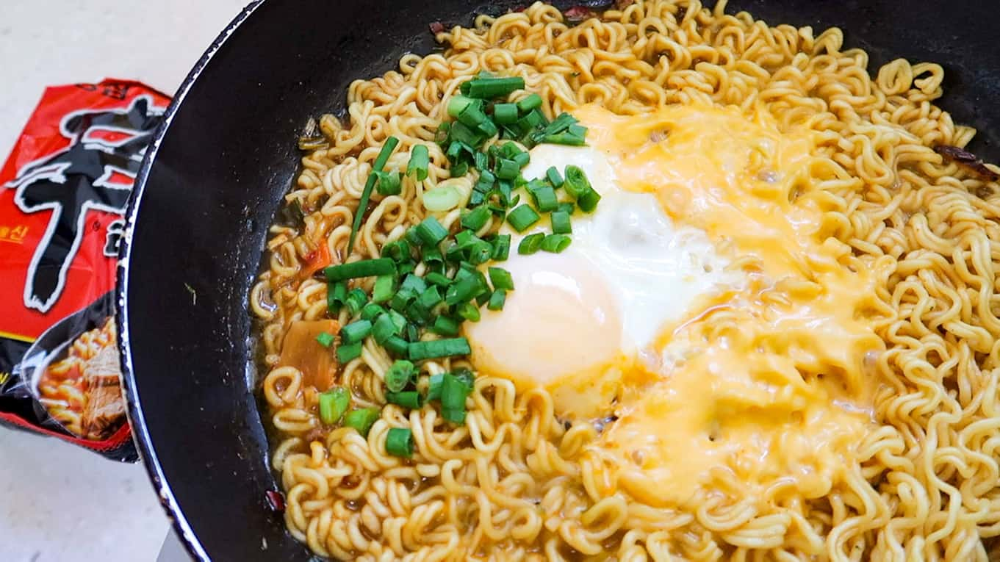

# Ramen

Good and tasty and superior Ramen.

- 1 Black Shin Ramyun Packet
- 1 Egg
- 1 slice American Cheese
- Kimchi

1. Bring pot with 2 cups of water to boil
2. Add ramen seasonings and powder
3. Add ramen noodles and let cook for 5 minutes, stirring occasionally to separate noodles
4. Crack egg into soup and let cook for another 2 minutes or until desired texture
5. Remove soup from heat
6. Add cheese to top
7. Enjoy with kimchi to taste

